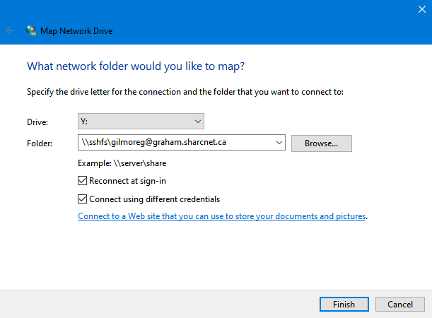
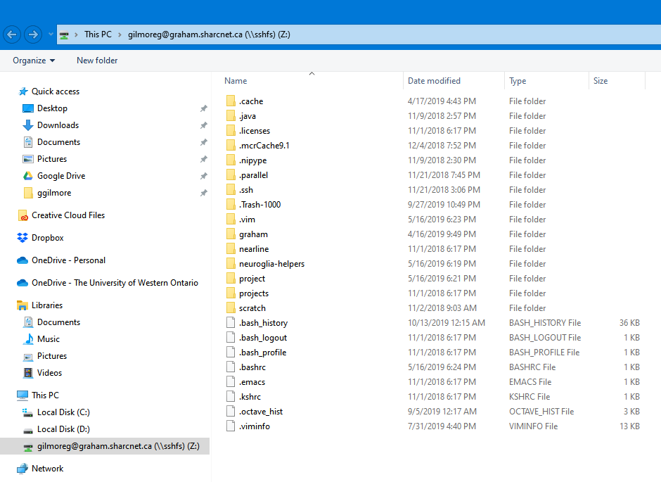

1. Install the latest stable installer of [WinFSP](https://github.com/billziss-gh/winfsp/releases)
2. Install the latest stable installer of [SSHFS-Win](https://github.com/billziss-gh/sshfs-win/releases)
3. Open __File Explorer__, right-click on __This PC__ and choose __Map network drive__. Choose a drive to mount at and enter the following in the folder field:

    ```console
    \\sshfs\[your_login_name]@graham.computecanada.ca/projects/rrg-akhanf/cfmm-bids
    ```

4. Ensure you check the box __Connect using different credentials__ if your computer login password is different from Sharcnet.

<p align="center">
  
</p>

5. You should then see the network drive in your file explorer!

<p align="center">
  
</p>

