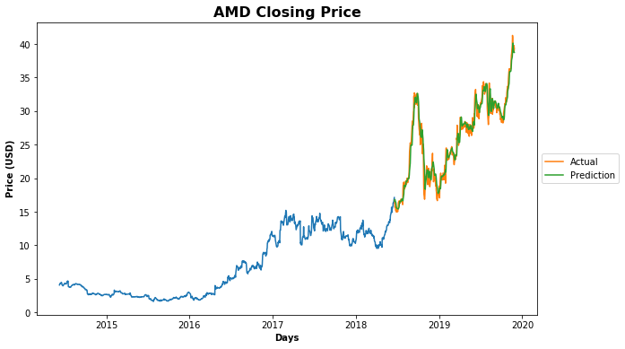

# Scraping Dataset 

The data that we are going to use for this article will be downloaded from Yahoo Finance. For training our algorithm, we will be using the Apple stock prices for the past 5 years. To perform this task we will first define a function that will work to scrape the Yahoo finance website.


```python
import pandas as pd
import numpy as np
import requests
import re
from datetime import datetime, timedelta
from io import StringIO

###############################################################################
#                   Data Scraping Class for Yahoo Finance                     #
###############################################################################
class YahooFinanceHistory:
    timeout = 2
    crumb_link = 'https://finance.yahoo.com/quote/{0}/history?p={0}'
    crumble_regex = r'CrumbStore":{"crumb":"(.*?)"}'
    quote_link = 'https://query1.finance.yahoo.com/v7/finance/download/{quote}?period1={dfrom}&period2={dto}&interval=1d&events=history&crumb={crumb}'

    def __init__(self, symbol, days_back=7):
        self.symbol = symbol
        self.session = requests.Session()
        self.dt = timedelta(days=days_back)

    def get_crumb(self):
        response = self.session.get(self.crumb_link.format(self.symbol), timeout=self.timeout)
        response.raise_for_status()
        match = re.search(self.crumble_regex, response.text)
        if not match:
            raise ValueError('Could not get crumb from Yahoo Finance')
        else:
            self.crumb = match.group(1)

    def get_quote(self):
        if not hasattr(self, 'crumb') or len(self.session.cookies) == 0:
            self.get_crumb()
        now = datetime.utcnow()
        dateto = int(now.timestamp())
        datefrom = int((now - self.dt).timestamp())
        url = self.quote_link.format(quote=self.symbol, dfrom=datefrom, dto=dateto, crumb=self.crumb)
        response = self.session.get(url)
        response.raise_for_status()
        return pd.read_csv(StringIO(response.text), parse_dates=['Date'])
```


```python
stock = 'AMD'

df = YahooFinanceHistory(stock, days_back=2000).get_quote()
```


```python
df.tail()
```


<div>
<style scoped>
    .dataframe tbody tr th:only-of-type {
        vertical-align: middle;
    }

    .dataframe tbody tr th {
        vertical-align: top;
    }

    .dataframe thead th {
        text-align: right;
    }
</style>
<table border="1" class="dataframe">
  <thead>
    <tr style="text-align: right;">
      <th></th>
      <th>Date</th>
      <th>Open</th>
      <th>High</th>
      <th>Low</th>
      <th>Close</th>
      <th>Adj Close</th>
      <th>Volume</th>
    </tr>
  </thead>
  <tbody>
    <tr>
      <th>1375</th>
      <td>2019-11-21</td>
      <td>40.419998</td>
      <td>40.709999</td>
      <td>38.639999</td>
      <td>39.520000</td>
      <td>39.520000</td>
      <td>88069400</td>
    </tr>
    <tr>
      <th>1376</th>
      <td>2019-11-22</td>
      <td>39.360001</td>
      <td>39.889999</td>
      <td>38.189999</td>
      <td>39.150002</td>
      <td>39.150002</td>
      <td>56931900</td>
    </tr>
    <tr>
      <th>1377</th>
      <td>2019-11-25</td>
      <td>39.500000</td>
      <td>40.169998</td>
      <td>39.490002</td>
      <td>39.790001</td>
      <td>39.790001</td>
      <td>45769500</td>
    </tr>
    <tr>
      <th>1378</th>
      <td>2019-11-26</td>
      <td>39.299999</td>
      <td>39.480000</td>
      <td>38.810001</td>
      <td>38.990002</td>
      <td>38.990002</td>
      <td>43603300</td>
    </tr>
    <tr>
      <th>1379</th>
      <td>2019-11-27</td>
      <td>39.459999</td>
      <td>39.759998</td>
      <td>39.070000</td>
      <td>39.410000</td>
      <td>39.410000</td>
      <td>33630100</td>
    </tr>
  </tbody>
</table>
</div>


```python
import matplotlib.pyplot as plt
from pandas.plotting import register_matplotlib_converters
register_matplotlib_converters()

df_plot = df
#setting index as date
df_plot['Date'] = pd.to_datetime(df_plot.Date,format='%Y-%m-%d')
df_plot.index = df_plot['Date']

#plot
plt.figure(figsize=(16,8));
plt.plot(df_plot['Close'], label='Close Price history');
plt.title('{} 5 Year Stock Price'.format(stock), fontweight='bold', fontsize=16);
plt.xlabel('Days', fontweight='bold');
plt.ylabel('Price (USD)', fontweight='bold');
```


You can see that the trend is highly non-linear and it is very difficult to capture the trend using this information. This is where the power of **Long Short-Term Memory network** (LSTM) can be utilized. LSTM is a type of recurrent neural network capable of remembering the past information and while predicting the future values, it takes this past information into account.

## Predicting Future Stock Prices

Stock price prediction is similar to any other machine learning problem where we are given a set of features and we have to predict a corresponding value. We will perform the same steps as we do perform in order to solve any machine learning problem.

As a rule of thumb, whenever you use a neural network, you should normalize or scale your data. We will use **MinMaxScaler** class from the *sklearn.preprocessing* library to scale our data between 0 and 1.

As mentioned earlier, in a time series problems, we have to predict a value at time T, based on the data from days T-N where N can be any number of steps. In this tutorial, we are going to predict the opening stock price of the data based on the opening stock prices for the past 60 days (*prediction_window_size*). I have tried and tested different numbers and found that the best results are obtained when past 60 time steps are used. You can try different numbers and see how your algorithm performs.


```python
from sklearn.preprocessing import MinMaxScaler
from sklearn.model_selection import train_test_split

# Number of days to use for prediction
prediction_window_size = 60

# Creating dataframe
data = df.sort_index(ascending=True, axis=0)
new_data = pd.DataFrame(index=range(0,len(df)),columns=['Date', 'Close'])
for i in range(0,len(data)):
    new_data['Date'][i] = data['Date'][i]
    new_data['Close'][i] = data['Close'][i]

# Setting index
new_data.index = new_data.Date
new_data.drop('Date', axis=1, inplace=True)

# Converting dataset into x_train and y_train
scaler = MinMaxScaler(feature_range=(0, 1))
scaled_data = scaler.fit_transform(new_data.values)

x_train, y_train = [], []
for i in range(prediction_window_size, len(scaled_data)):
    x_train.append(scaled_data[i-prediction_window_size:i,0])
    y_train.append(scaled_data[i,0])

x_train, y_train = np.array(x_train), np.array(y_train)
x_train = np.reshape(x_train, (x_train.shape[0],x_train.shape[1],1))
```

In the script above we create two lists: x_train (features) and y_train (labels). There are 1380 records in the scaled_data data. We execute a loop that starts from 61st record and stores all the previous 60 records to the feature_set list. The 61st record is stored in the y_train labels list. We need to convert both the x_train and the y_train lists to numpy arrays before we can use it for training. 

In order to train LSTM on our data, we need to convert our data into the shape accepted by the LSTM. We need to convert our data into three-dimensional format. The first dimension is the number of records or rows in the dataset which is 1320 in our case. The second dimension is the number of time steps which is 60 while the last dimension is the number of indicators. Since we are only using one feature, i.e Close, the number of indicators will be one.

## Create and Fit LSTM Network

We have preprocessed our data and have converted it into the desired format. Now is the time to create our LSTM. The LSTM model that we are going to create will be a sequential model with multiple layers. We will add four LSTM layers to our model followed by a dense layer that predicts the future stock price.

In the script below we imported the **Sequential** class from *keras.models* library and **Dense**, **LSTM**, and **Dropout** classes from *keras.layers* library. To add a layer to the sequential model, the add method is used. Inside the add method, we passed our LSTM layer. The first parameter to the LSTM layer is the number of neurons or nodes that we want in the layer. The second parameter is return_sequences, which is set to true since we will add more layers to the model. The first parameter to the input_shape is the number of time steps while the last parameter is the number of indicators.

### Creating LSTM and Dropout Layers

Let's now add a dropout layer to our model. Dropout layer is added to avoid over-fitting, which is a phenomenon where a machine learning model performs better on the training data compared to the test data. We will then add three more LSTM and dropout layers to our model.

### Creating Dense Layer

To make our model more robust, we add a dense layer at the end of the model. The number of neurons in the dense layer will be set to 1 since we want to predict a single value in the output.

### Model Compilation

Finally, we need to compile our LSTM before we can train it on the training data. The following script compiles the our model. We call the compile method on the Sequential model object which is "model" in our case. We use the mean squared error as loss function and to reduce the loss or to optimize the algorithm, we use the adam optimizer.

### Algorithm Training

Now is the time to train the model that we defined. To do so, we call the **fit** method on the model and pass it our training features and labels. Depending upon your hardware, model training can take some time.


```python
from keras.models import Sequential
from keras.layers import Dense, Dropout, LSTM

# Initialising the RNN
model = Sequential()

# Adding the first LSTM layer and some Dropout regularisation
model.add(LSTM(units = 50, return_sequences = True, input_shape = (x_train.shape[1], 1)))
model.add(Dropout(0.2))

# Adding a second LSTM layer and some Dropout regularisation
model.add(LSTM(units = 50, return_sequences = True))
model.add(Dropout(0.2))

# Adding a third LSTM layer and some Dropout regularisation
model.add(LSTM(units = 50, return_sequences = True))
model.add(Dropout(0.2))

# Adding a fourth LSTM layer and some Dropout regularisation
model.add(LSTM(units = 50))
model.add(Dropout(0.2))

# Adding the output layer
model.add(Dense(units = 1))

# Compiling the RNN
model.compile(optimizer = 'adam', loss = 'mean_squared_error')

# Fitting the RNN to the Training set
model.fit(x_train, y_train, epochs = 100, batch_size = 32,verbose=0);
```

    WARNING:tensorflow:From C:\Users\Greydon\Anaconda3\lib\site-packages\tensorflow_core\python\ops\resource_variable_ops.py:1630: calling BaseResourceVariable.__init__ (from tensorflow.python.ops.resource_variable_ops) with constraint is deprecated and will be removed in a future version.
    Instructions for updating:
    If using Keras pass *_constraint arguments to layers.
    WARNING:tensorflow:From C:\Users\Greydon\Anaconda3\lib\site-packages\keras\backend\tensorflow_backend.py:422: The name tf.global_variables is deprecated. Please use tf.compat.v1.global_variables instead.
    


## Testing our LSTM

We have successfully trained our LSTM, now is the time to test the performance of our algorithm on the test set by predicting the opening stock prices for one full year. However, as we did with the training data, we need to convert our test data in the right format.


```python
# predicting 246 values, using past 60 from the train data
total_prediction_days = 365
inputs = new_data[-(total_prediction_days+prediction_window_size):].values
inputs = inputs.reshape(-1,1)
inputs = scaler.transform(inputs)

X_test = []
for i in range(prediction_window_size, inputs.shape[0]):
    X_test.append(inputs[i-prediction_window_size:i,0])

X_test = np.array(X_test)
X_test = np.reshape(X_test, (X_test.shape[0], X_test.shape[1], 1))
```

### Making Predictions

Now is the time to see the magic. We preprocessed our test data and now we can use it to make predictions. To do so, we simply need to call the **predict** method on the model that we trained. Since we scaled our data, the predictions made by the LSTM are also scaled. We need to reverse the scaled prediction back to their actual values. To do so, we can use the **ìnverse_transform** method of the scaler object we created during training. Take a look at the following script:


```python
closing_price = model.predict(X_test)
closing_price = scaler.inverse_transform(closing_price)
```

## How Did We Do?


```python
# Split data into test and train sets
data_idx = len(new_data) - len(closing_price)
train.loc[:,0] = new_data[:data_idx]
valid.loc[:,0] = new_data[data_idx:]
valid.loc[:,'Predictions'] = closing_price
```


```python
fig, ax = plt.subplots(figsize=(10,6))
plt1 = ax.plot(train['Close']);
plt2 = ax.plot(valid[['Close', 'Predictions']]);
plt.title('{} Closing Price'.format(stock), fontweight='bold', fontsize=16)
plt.xlabel('Days', fontweight='bold')
plt.ylabel('Price (USD)', fontweight='bold')
plt.legend(plt2, ('Actual', 'Prediction'), loc='center left', bbox_to_anchor=(1, 0.5));
```





```python
y_pred = (closing_price > 0.5)
valid_true = new_data.values[-len(closing_price):]
rms = np.sqrt(np.mean(np.power((valid_true-closing_price),2)))


trade_dataset_temp = df
trade_dataset_temp['y_pred'] = np.NaN
trade_dataset_temp.iloc[(len(trade_dataset_temp) - len(y_pred)):,-1:] = y_pred

trade_dataset = trade_dataset_temp.dropna()
trade_dataset['Tomorrows Returns'] = 0.
trade_dataset['Tomorrows Returns'] = np.log(trade_dataset['Close']/trade_dataset['Close'].shift(1))
trade_dataset['Tomorrows Returns'] = trade_dataset['Tomorrows Returns'].shift(-1)
trade_dataset['Strategy Returns'] = 0.
trade_dataset['Strategy Returns'] = np.where(trade_dataset['y_pred'] == True, trade_dataset['Tomorrows Returns'], - trade_dataset['Tomorrows Returns'])
trade_dataset['Cumulative Market Returns'] = np.cumsum(trade_dataset['Tomorrows Returns'])
trade_dataset['Cumulative Strategy Returns'] = np.cumsum(trade_dataset['Strategy Returns'])
plt.figure(figsize=(10,5))
plt.plot(trade_dataset['Cumulative Market Returns'], color='r', label='Market Returns')
plt.plot(trade_dataset['Cumulative Strategy Returns'], color='g', label='Strategy Returns')
plt.legend()
plt.show()
```

    C:\Users\Greydon\Anaconda3\lib\site-packages\ipykernel_launcher.py:12: SettingWithCopyWarning: 
    A value is trying to be set on a copy of a slice from a DataFrame.
    Try using .loc[row_indexer,col_indexer] = value instead
    
    See the caveats in the documentation: http://pandas.pydata.org/pandas-docs/stable/indexing.html#indexing-view-versus-copy
      if sys.path[0] == '':
    C:\Users\Greydon\Anaconda3\lib\site-packages\ipykernel_launcher.py:13: SettingWithCopyWarning: 
    A value is trying to be set on a copy of a slice from a DataFrame.
    Try using .loc[row_indexer,col_indexer] = value instead
    
    See the caveats in the documentation: http://pandas.pydata.org/pandas-docs/stable/indexing.html#indexing-view-versus-copy
      del sys.path[0]
    C:\Users\Greydon\Anaconda3\lib\site-packages\ipykernel_launcher.py:14: SettingWithCopyWarning: 
    A value is trying to be set on a copy of a slice from a DataFrame.
    Try using .loc[row_indexer,col_indexer] = value instead
    
    See the caveats in the documentation: http://pandas.pydata.org/pandas-docs/stable/indexing.html#indexing-view-versus-copy
      
    C:\Users\Greydon\Anaconda3\lib\site-packages\ipykernel_launcher.py:15: SettingWithCopyWarning: 
    A value is trying to be set on a copy of a slice from a DataFrame.
    Try using .loc[row_indexer,col_indexer] = value instead
    
    See the caveats in the documentation: http://pandas.pydata.org/pandas-docs/stable/indexing.html#indexing-view-versus-copy
      from ipykernel import kernelapp as app
    C:\Users\Greydon\Anaconda3\lib\site-packages\ipykernel_launcher.py:16: SettingWithCopyWarning: 
    A value is trying to be set on a copy of a slice from a DataFrame.
    Try using .loc[row_indexer,col_indexer] = value instead
    
    See the caveats in the documentation: http://pandas.pydata.org/pandas-docs/stable/indexing.html#indexing-view-versus-copy
      app.launch_new_instance()
    C:\Users\Greydon\Anaconda3\lib\site-packages\ipykernel_launcher.py:17: SettingWithCopyWarning: 
    A value is trying to be set on a copy of a slice from a DataFrame.
    Try using .loc[row_indexer,col_indexer] = value instead
    
    See the caveats in the documentation: http://pandas.pydata.org/pandas-docs/stable/indexing.html#indexing-view-versus-copy
    C:\Users\Greydon\Anaconda3\lib\site-packages\ipykernel_launcher.py:18: SettingWithCopyWarning: 
    A value is trying to be set on a copy of a slice from a DataFrame.
    Try using .loc[row_indexer,col_indexer] = value instead
    
    See the caveats in the documentation: http://pandas.pydata.org/pandas-docs/stable/indexing.html#indexing-view-versus-copy


```python

```
